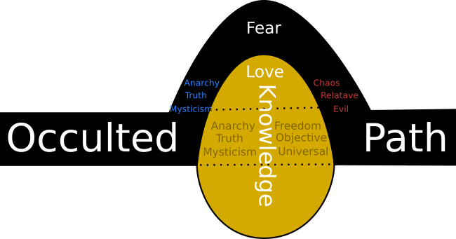

# Crossing Occulted Knowledge Country

One thing I've noticed when walking down a path is that it's safe and easy to follow. But sometimes you need to cross open terrain if you want to get to where you are going. Streets that are paved to make it easier for us to get around are great, but they can also limit us. They limit us because we become used to using them to get around and we fail to see the warning signs when those paths take us around things that are important to our growth. We typically tend to want to make things easier on ourselves by taking an easy path, but sometimes you need to go cross country to recognize or remember what's true about yourself and the world around you.

On one of Mark Passio shows "[What on earth is happening](http://www.whatonearthishappening.com/)" a caller mentioned that he was involved in a Buddhism religion for many years. He accounted that the particular sect he was a part of did not want to talk about occulted knowledge, and I consider that similar to wanting take the road that's easiest to travel instead of going cross-country between the roads. Taking paths laid out for us in non-occulted knowledge which makes us very easy to control as those paths can be made by people that want to take us away from the important stuff.

In order to be awaken beings we have to be careful of allowing ourselves to be set on paths that have been ingrained as to keep our minds open to truth that exists outside of the narratives we are given in our own particular areas of expertize or interest.

I suggest that people listen to Mark Passio's show [What on earth is happening](http://www.whatonearthishappening.com/)" from beginning to end. As Mark says his work is a tapestry of knowledge. The knowledge that Mark provides is like cutting cross country to get to a destination that want to arrive at. You can use the roads but little by little you miss information that is important for you to use when you get to where you are going.
