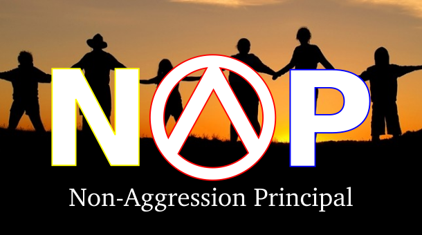

# Non-Aggression Principal

## Etymology

**force (n.)**

c. 1300, "physical strength," from Old French force "force, strength; courage, fortitude; violence, power, compulsion" (12c.), from Vulgar Latin \*fortia (source also of Old Spanish forzo, Spanish fuerza, Italian forza), noun use of neuter plural of Latin fortis "strong, mighty; firm, steadfast; brave, bold" (see fort).

Meanings "power to convince the mind" and "power exerted against will or consent" are from mid-14c. Meaning "body of armed men, a military organization" first recorded late 14c. (also in Old French). Physics sense is from 1660s; force field attested by 1920. Related: Forces.

**violence (n.)**

late 13c., "physical force used to inflict injury or damage," from Anglo-French and Old French violence (13c.), from Latin violentia "*vehemence*, impetuosity," from violentus "vehement, forcible," probably related to violare (see violation). Weakened sense of "improper treatment" is attested from 1590s.

**vehemence (n.)**

c. 1400, from Old French vehemence, veemence "forcefulness, violence, *rashness*" or directly from Latin vehementia "eagerness, strength," from stem of vehere "to carry" (see vehicle). Related: Vehemency.

**rash (adj.)**

late 14c., "nimble, quick, vigorous" (early 14c. as a surname), a Scottish and northern word, perhaps from Old English -ræsc (as in ligræsc "flash of lightning") or one of its Germanic cognates, from Proto-Germanic \*raskuz (source also of Middle Low German rasch, Middle Dutch rasc "quick, swift," German rasch "quick, fast"). Related to Old English horsc "quick-witted." Sense of "reckless, impetuous, heedless of consequences" is attested from c. 1500. Related: Rashly; rashness.

## Introduction

There is quite a bit of ambiguity about the non-aggression principal as people from different mindsets have laid claim to the principal. To further peace in the world between every living being, my take on the NAP is based on 1. [Natural Rights](https://en.wikipedia.org/wiki/Natural_rights) and 2. Understanding the differences between violence and force via [etymology](etymonline.com).

NAP means that you only use force against a violation of your or another's natural right to life, freedom or property.

Violence is when an idea is set in the mind to cause harm to another without just cause. Force rises out of a instinctual desire to protect and usually is not associated with any thoughts that involve planning or premeditation.

When violence is committed an unbalance occurs in the universe that must eventually be balanced by some action. A violent person can accumulate negative karma against him or herself when this unbalance is left unchecked. That person may experience violence reacted against him or her from a cause and effect event and that may continue until the balance is restored by the reconciliatory actions of the initiator of the violence, or some other reaction that ends the life (or) freedom of the initiator. Please note that the reaction does not need to take the form of physical violence. There are other forms of violence.
